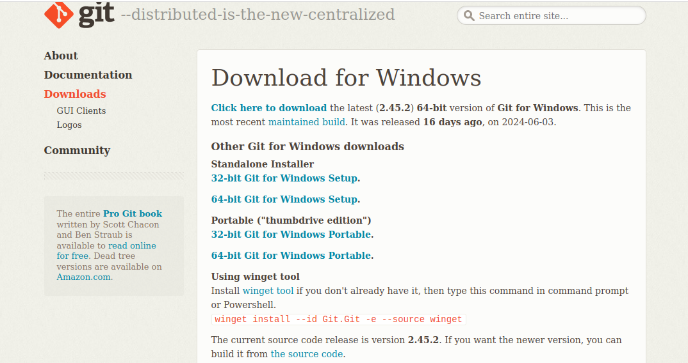

    I summarized the work in this pdf because i unable to add mages
    https://drive.google.com/file/d/1TIzeBu3LkAAt1DDveI4Z7cjuy8ro7YFP/view?usp=sharing

    1.Select Your Operating System (OS): Choose an operating system that best suits your preferences and project requirements. Download and Install Windows 11

    To install Windows 11, I visited the official Microsoft website at https://www.microsoft.com/software-download/windows11 and downloaded the Windows 11 Disk Image (ISO) onto my USB drive. Afterward, I turned on my PC and pressed the designated key to open the boot-device selection menu. From there, I chose the option to boot the PC from the USB flash drive. This initiated the Windows Setup process, where I followed the on-screen instructions to complete the installation of Windows 11
    

    2.Install a Text Editor or Integrated Development Environment (IDE): Select and install a text editor or IDE suitable for your programming languages and workflow. Download and Install Visual Studio Code. https://code.visualstudio.com/Download

    To install a text editor, I visited https://code.visualstudio.com/Download to download Visual Studio. Once the download finished, I ran the installer and proceeded to accept the terms and conditions. Then, I clicked on "Install" to initiate the installation process. I waited for the setup to complete, and once done, I clicked on "Launch" to open Visual Studio Code . After that, I downloaded some extensions like Live Server and Prettier for formatting my code.

    3.Set Up Version Control System: Install Git and configure it on your local machine. Create a GitHub account for hosting your repositories. Initialize a Git repository for your project and make your first commit. https://github.com

    I began by installing Git on my laptop from https://git-scm.com/ and carefully configuring it. The next step was creating a GitHub account at https://github.com to host my repositories. With my GitHub account set up, I proceeded to initialize a Git repository for my current project. This involved connecting Git with GitHub, then adding a README.md file. I added and committed the README.md file locally, then pushed it to GitHub.

    4. Install Necessary Programming Languages and Runtimes: Instal Python from http://wwww.python.org programming language required for your project and install their respective compilers, interpreters, or runtimes. Ensure you have the necessary tools to build and execute your code.

    I visited the official Python website, https://www.python.org/downloads/, where I downloaded Python for Windows. After downloading, I double-clicked the installer and followed the on-screen instructions. To verify the installation, I opened a command prompt window and typed python --version , confirming the installed Python version. Additionally, I enhanced my development environment by adding extensions in Visual Studio Code. I proceeded by creating a file named main.py and saved it to start working on my project.

    5.Configure a Database (MySQL): Download and install MySQL database. https://dev.mysql.com/downloads/windows/installer/5.7.html

    I visited the MySQL Community Downloads page to obtain MySQL. Once downloaded, I ran the installer, opting for the "Developer Default" setup, which includes MySQL Server, MySQL Workbench, connectors, and additional tools. After accepting the license agreement and specifying the installation directory, I proceeded with the default setup type. During installation, I configured MySQL Server to operate as a standalone server. I set a strong and secure password for the root user and chose to install MySQL Server as a Windows Service for convenience. Upon completing the installation, I closed the installer by clicking "Finish". To confirm the successful installation, I launched MySQL Workbench and connected to MySQL Server using the root user credentials set during installation.

THIS IS THE PDF CONTAINING IMAGES
https://drive.google.com/file/d/1TIzeBu3LkAAt1DDveI4Z7cjuy8ro7YFP/view?usp=sharing
